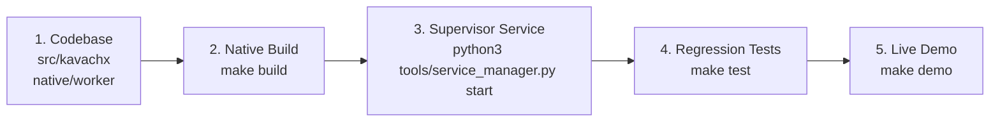

# KavachX — Getting Started Guide

Welcome to **KavachX**, an enterprise edge computer vision appliance designed for real-time industrial safety perception. This guide provides a 5-minute technical overview for engineers, evaluators, and operators.

---

## 1. System Orientation



---

## 2. Quick Commands

### Running from Windows Workstation (VS Code Terminal)
```powershell
# 1. Run Live Interactive Demo (Worker Health + 50 Live Stream Frames)
python tools/target_runner.py "cd /home/work_user2/kawachx_task && make demo"

# 2. Watch Real-Time Detections & Bounding Boxes Frame-by-Frame
python tools/target_runner.py "cd /home/work_user2/kawachx_task && python3 tools/live_camera_viewer.py 20"

# 3. Run Automated Regression Test Suite
python tools/target_runner.py "cd /home/work_user2/kawachx_task && make test"

# 4. Inspect Service Health State
python tools/target_runner.py "cat /tmp/kawach_health.json"
```

### Running Directly on the Qualcomm Linux EdgeBox (via SSH)
```bash
ssh work_user2@ssh.kavachx.io
cd /home/work_user2/kawachx_task

# Build the native C++ FastRPC worker
make build

# Start the supervisor daemon
python3 tools/service_manager.py start

# Run automated tests
make test

# Launch live demo
make demo
```
