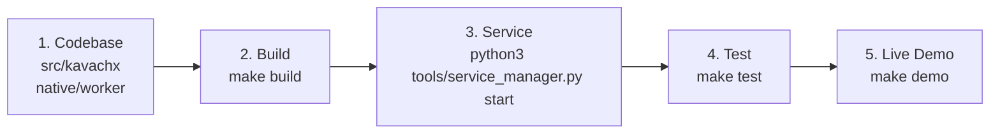

# KavachX Getting Started Guide

Welcome to **KavachX**, an enterprise edge computer vision solution accelerated by the **Qualcomm Hexagon v68 HTP DSP**.

---

## 1. Quick Orientation



---

## 2. Quick Commands

### From Windows Desktop (VS Code PowerShell)
```powershell
# Run Live Demo
python tools/target_runner.py "cd /home/work_user2/kawachx_task && make demo"

# Stream Live Bounding Boxes Frame-by-Frame
python tools/target_runner.py "cd /home/work_user2/kawachx_task && python3 tools/live_camera_viewer.py 20"

# Run Regression Suite
python tools/target_runner.py "cd /home/work_user2/kawachx_task && make test"
```

### Directly on the Qualcomm Linux EdgeBox
```bash
make build
python3 tools/service_manager.py start
make test
make demo
```
