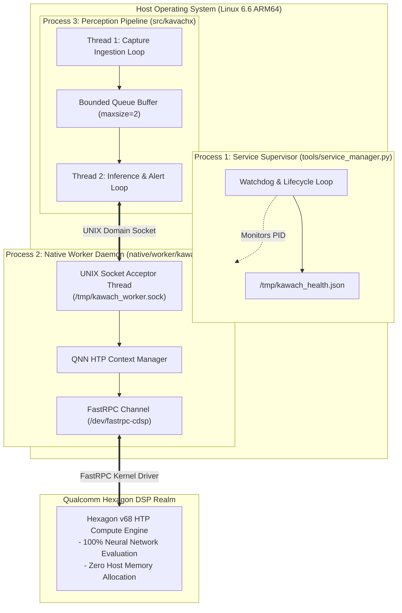

# KavachX Process Architecture

## 1. Process & Memory Layout

---

## 2. Process Isolation & Fault Boundaries
1. **Daemon Independence:** `kawach_worker` operates as a persistent daemon. Client terminations or camera stream failures do not terminate the FastRPC context or cause DSP resets.
2. **Memory Safety:** The C++ daemon pre-allocates QNN input/output RPCMem buffers during startup. No dynamic heap allocations occur during the per-frame inference loop.
3. **Supervisor Self-Healing:** If `kawach_worker` receives a `SIGKILL` or encounters an unhandled exception, `tools/service_manager.py` detects the dead PID, cleans the socket, and restarts the daemon within $2.0\text{ seconds}$.
