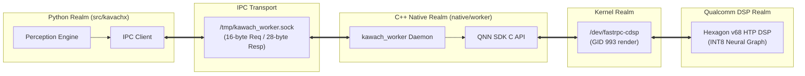

# Runtime Architecture & Boundary Specifications

## 1. Runtime Layer Interactions

```mermaid
flowchart LR
    subgraph PYTHON_REALM["Python Realm (src/kavachx)"]
        APP["Perception Engine"]
        IPC_C["IPC Client"]
        APP --> IPC_C
    end

    subgraph SOCKET_REALM["IPC Transport"]
        UNIX_SOCK["/tmp/kawach_worker.sock\n(16-byte Req / 28-byte Resp)"]
    end

    subgraph NATIVE_REALM["C++ Native Realm (native/worker)"]
        WORKER["kawach_worker Daemon"]
        QNN_API["QNN SDK C API"]
        WORKER --> QNN_API
    end

    subgraph KERNEL_REALM["Kernel Realm"]
        FASTRPC_DEV["/dev/fastrpc-cdsp\n(GID 993 render)"]
    end

    subgraph HARDWARE_REALM["Qualcomm DSP Realm"]
        HTP["Hexagon v68 HTP DSP\n(INT8 Neural Graph)"]
    end

    IPC_C <==> UNIX_SOCK
    UNIX_SOCK <==> WORKER
    QNN_API <==> FASTRPC_DEV
    FASTRPC_DEV <==> HTP
```
