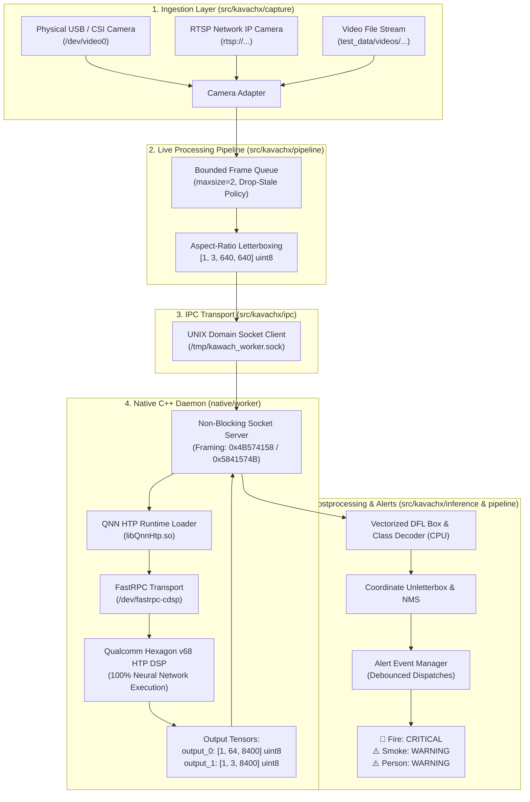

# KavachX System Architecture

## 1. Purpose & Problem Statement
KavachX is an enterprise edge computer vision appliance designed for continuous industrial safety monitoring. It detects **Fire, Smoke, and Persons** entirely on-device without cloud dependency.

The system is deployed on the **Qualcomm QCS6490 SoC** (Radxa Dragon Q6490 / Kavach-EdgeBox). To operate 24/7 within strict thermal envelopes while leaving CPU headroom for multi-camera video decoding and alert dispatching, all deep learning inference is offloaded to the **Qualcomm Hexagon v68 HTP DSP**.

---

## 2. High-Level System Architecture

---

## 3. Boundary Definitions

### 3.1 Hardware vs. Software Boundary
- **Hexagon v68 HTP DSP:** Executes all convolutional layers, C2f feature extraction blocks, SPPF pooling, and detection head convolution layers ($99.7\%$ of total model FLOPs).
- **Kryo 670 CPU:** Handles video decompression (OpenCV/V4L2), aspect-ratio letterbox padding, DFL coordinate math, and NMS box filtering ($<1	ext{ ms}$).

### 3.2 Python vs. C++ Process Boundary
- **C++ Native Daemon (`native/worker`):** Long-running background daemon holding an open FastRPC session (`/dev/fastrpc-cdsp`). Survives Python client restarts.
- **Python Application (`src/kavachx`):** Stateless client communicating with the daemon over a framed UNIX stream socket (`/tmp/kawach_worker.sock`).
