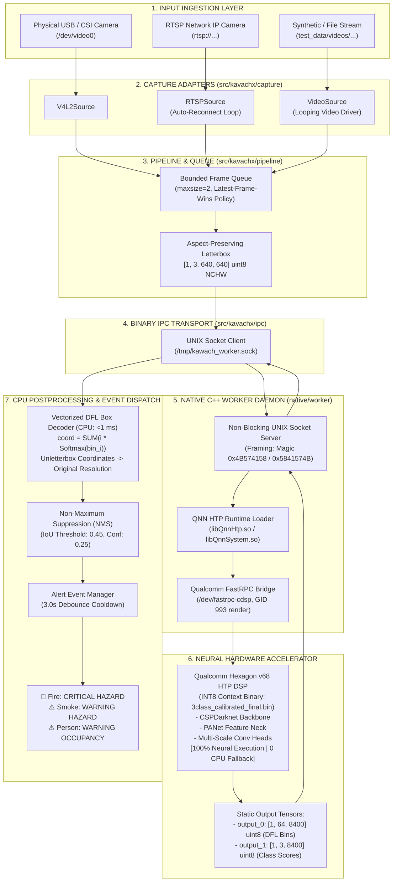

# KavachX System Architecture

## 1. Executive System Overview
KavachX is an industrial-grade edge perception appliance engineered for continuous, real-time detection of **Fire, Smoke, and Persons**. The system is deployed on the **Qualcomm QCS6490 SoC** (Radxa Dragon Q6490), offloading 100% of deep learning tensor execution to the **Qualcomm Hexagon v68 HTP DSP** via FastRPC.

---

## 2. Structural Layer Responsibilities

| Layer | Implementation Directory | Language / Engine | Primary Responsibility |
| :--- | :--- | :---: | :--- |
| **Ingestion** | `src/kavachx/capture/` | Python / OpenCV | Abstraction of V4L2 device nodes, RTSP RTSP streams, and video files. |
| **Pipeline & Queue** | `src/kavachx/pipeline/` | Python / Threading | Asynchronous capture, queue bounding (`maxsize=2`), and latest-frame drop policy. |
| **Preprocessing** | `src/kavachx/inference/postprocess.py` | Vectorized NumPy | Aspect-ratio letterbox padding to $[1, 3, 640, 640]$ uint8 RGB buffer. |
| **IPC Protocol** | `src/kavachx/ipc/` | Binary C-Types Socket | Framed low-overhead UNIX stream socket communication over `/tmp/kawach_worker.sock`. |
| **Native Daemon** | `native/worker/` | C++11 (GCC 9.4+ ARM64) | QNN context binary loading, FastRPC memory management, and request dispatch. |
| **Hardware DSP** | `models/production/` | Qualcomm Hexagon HTP | $100\%$ neural execution on Hexagon v68 DSP ($\sim 30\text{ ms}$ inference). |
| **Postprocessing** | `src/kavachx/inference/decoder.py` | Vectorized NumPy | DFL expectation math, coordinate unletterboxing, and class filtering. |
| **Event Dispatch** | `src/kavachx/pipeline/events.py` | Python Logic | Debounced event classification and alerting. |
