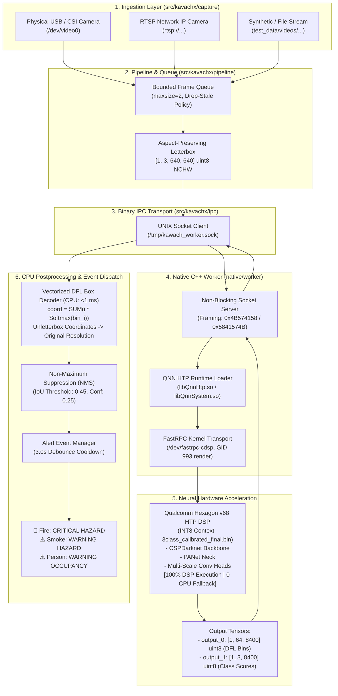

# System Overview & Architecture

## 1. Purpose & Problem Statement
KavachX is an edge-deployed computer vision system for continuous industrial safety monitoring. It detects **Fire, Smoke, and Persons** entirely on-device without reliance on cloud connectivity.

Deployed on the **Qualcomm QCS6490 SoC** (Radxa Dragon Q6490), the system offloads 100% of deep learning tensor computations to the **Qualcomm Hexagon v68 HTP DSP** via FastRPC (`/dev/fastrpc-cdsp`), achieving zero CPU/GPU neural network fallback while preserving host CPU cores for multi-camera video ingestion and alert dispatching.

---

## 2. High-Level Architecture Flowchart

