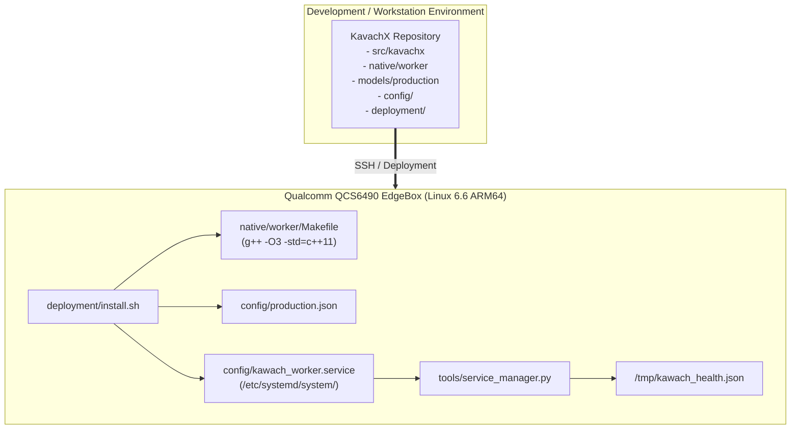

# Turnkey Deployment Architecture

```mermaid
flowchart TD
    subgraph DEV_BOX["Development / Workstation Environment"]
        REPO["KavachX Repository\n- src/kavachx\n- native/worker\n- models/production\n- config/\n- deployment/"]
    end

    subgraph TARGET["Qualcomm QCS6490 EdgeBox (Linux 6.6 ARM64)"]
        INSTALL["deployment/install.sh"]
        NATIVE_BUILD["native/worker/Makefile\n(g++ -O3 -std=c++11)"]
        CONFIG["config/production.json"]
        SYSTEMD["config/kawach_worker.service\n(/etc/systemd/system/)"]
        SUPERVISOR["tools/service_manager.py"]
        HEALTH["/tmp/kawach_health.json"]
    end

    REPO ==>|SSH / Deployment| TARGET
    INSTALL --> NATIVE_BUILD
    INSTALL --> CONFIG
    INSTALL --> SYSTEMD
    SYSTEMD --> SUPERVISOR
    SUPERVISOR --> HEALTH
```
