# Why Graph Splitting Was Required on Qualcomm HTP

## 1. The Dynamic DFL Compiler Blocker

```mermaid
flowchart TD
    subgraph BEFORE["ORIGINAL UNSPLIT MODEL (COMPILATION BLOCKED)"]
        M_IN1["Input: [1, 3, 640, 640]"] --> M_BB1["Backbone & Neck"]
        M_BB1 --> M_HEAD1["Detection Convolutions"]
        M_HEAD1 --> D_SLICE["Dynamic Slice & Concat Ops\n(16 DFL Distribution Bins)"]
        D_SLICE --> D_SOFT["Softmax & Grid Transformation"]
        D_SOFT --> FAIL_HTP["Qualcomm HTP Compiler Abort:\nDynamic tensor slices incompatible with static allocation"]
    end

    subgraph AFTER["KAVACHX TWO-TIER SPLIT ARCHITECTURE (VERIFIED PASS)"]
        M_IN2["Input: [1, 3, 640, 640]"] --> M_BB2["Backbone & Neck"]
        M_BB2 --> M_HEAD2["Detection Convolutions"]
        M_HEAD2 --> HTP_PASS["Static Output Tensors:\noutput_0: [1, 64, 8400] uint8\noutput_1: [1, 3, 8400] uint8\n(100% Executed on Hexagon DSP)"]
        HTP_PASS ==>|FastRPC IPC| CPU_DEC["Vectorized CPU Decoder:\nSoftmax + Coordinate Scaling (<1 ms)"]
        CPU_DEC --> FINAL_DET["Final Bounding Boxes & Classes"]
    end
```

---

## 2. Accuracy & Throughput Impact
- **Accuracy Parity:** $100\%$ Top-1 class agreement, $0.912$ Mean Box IoU overlap vs. FP32 baseline.
- **Throughput Benefit:** Retains full DSP hardware acceleration for $99.7\%$ of network operations, adding only $<1.0\text{ ms}$ CPU overhead.
