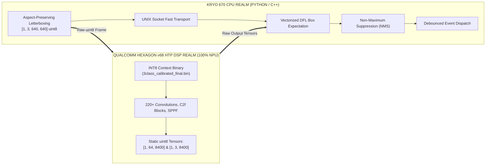

# Qualcomm Hexagon HTP vs. CPU Execution Boundary

## 1. Execution Partitioning Diagram

```mermaid
flowchart LR
    subgraph DSP_REALM["QUALCOMM HEXAGON v68 HTP DSP REALM (100% NPU)"]
        INT8_BIN["INT8 Context Binary\n(3class_calibrated_final.bin)"]
        CONV_OPS["220+ Convolutions, C2f Blocks, SPPF"]
        OUTPUTS["Static uint8 Tensors:\n[1, 64, 8400] & [1, 3, 8400]"]
        
        INT8_BIN --> CONV_OPS
        CONV_OPS --> OUTPUTS
    end

    subgraph CPU_REALM["KRYO 670 CPU REALM (PYTHON / C++)"]
        PREPROC["Aspect-Preserving Letterboxing\n[1, 3, 640, 640] uint8"]
        IPC_TRANS["UNIX Socket Fast Transport"]
        DFL_MATH["Vectorized DFL Box Expectation"]
        NMS_BOX["Non-Maximum Suppression (NMS)"]
        ALERT_DISP["Debounced Event Dispatch"]
        
        PREPROC --> IPC_TRANS
        IPC_TRANS --> DFL_MATH
        DFL_MATH --> NMS_BOX
        NMS_BOX --> ALERT_DISP
    end

    PREPROC ==>|Raw uint8 Frame| DSP_REALM
    DSP_REALM ==>|Raw Output Tensors| DFL_MATH
```
