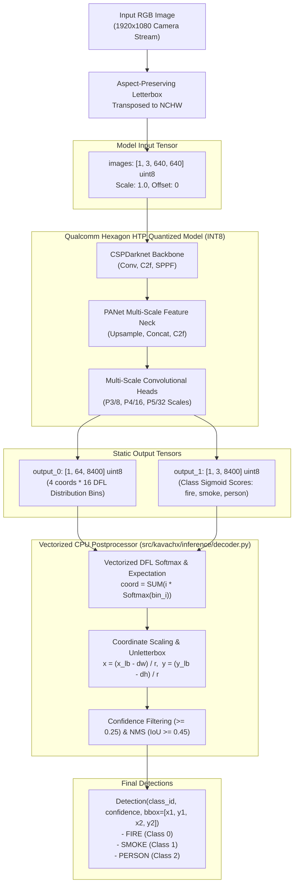

# Model Architecture & Tensor Contract

## 1. Visual Model Flow & Tensor Dimensions

---

## 2. Static Tensor Specifications

| Tensor Name | Direction | Tensor Shape | Data Type | Encoding Details | Description |
| :--- | :---: | :---: | :---: | :--- | :--- |
| `images` | Input | $[1, 3, 640, 640]$ | `uint8` | Scale: $1.0$, Offset: $0$ | Raw RGB letterboxed image buffer. |
| `output_0` | Output | $[1, 64, 8400]$ | `uint8` | Quantized DFL distributions | 4 coordinates $\times$ 16 distribution bins across 8400 anchors. |
| `output_1` | Output | $[1, 3, 8400]$ | `uint8` | Quantized sigmoid probabilities | Class scores for `fire`, `smoke`, and `person`. |
