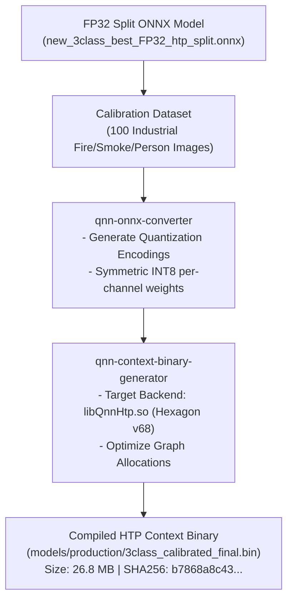

# Model Quantization & Compilation Methodology

## 1. Quantization Pipeline

---

## 2. Quantization Encodings
- **Input Tensor (`images`):** $[1, 3, 640, 640]$ `uint8`, scale: $1.0$, offset: $0$.
- **Output Tensor 0 (`output_0`):** $[1, 64, 8400]$ `uint8`, scale & offset mapped to 16 DFL distribution bins.
- **Output Tensor 1 (`output_1`):** $[1, 3, 8400]$ `uint8`, scale & offset mapped to sigmoid class probabilities.
