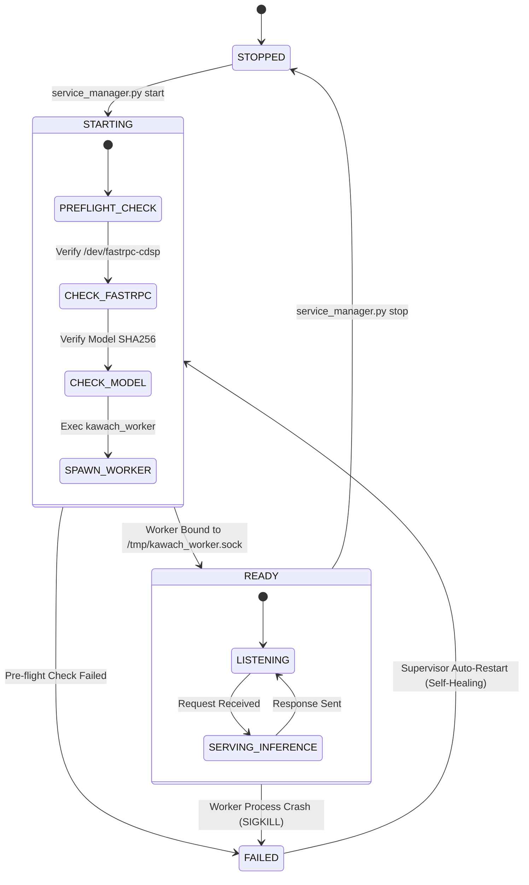

# Service Lifecycle & State Machine

```mermaid
stateDiagram-v2
    [*] --> STOPPED
    
    STOPPED --> STARTING: service_manager.py start
    
    state STARTING {
        [*] --> PREFLIGHT_CHECK
        PREFLIGHT_CHECK --> CHECK_FASTRPC: Verify /dev/fastrpc-cdsp
        CHECK_FASTRPC --> CHECK_MODEL: Verify Model SHA256
        CHECK_MODEL --> SPAWN_WORKER: Exec kawach_worker
    }
    
    STARTING --> READY: Worker Bound to /tmp/kawach_worker.sock
    STARTING --> FAILED: Pre-flight Check Failed
    
    state READY {
        [*] --> LISTENING
        LISTENING --> SERVING_INFERENCE: Request Received
        SERVING_INFERENCE --> LISTENING: Response Sent
    }
    
    READY --> FAILED: Worker Process Crash (SIGKILL)
    FAILED --> STARTING: Supervisor Auto-Restart (Self-Healing)
    
    READY --> STOPPED: service_manager.py stop
```
