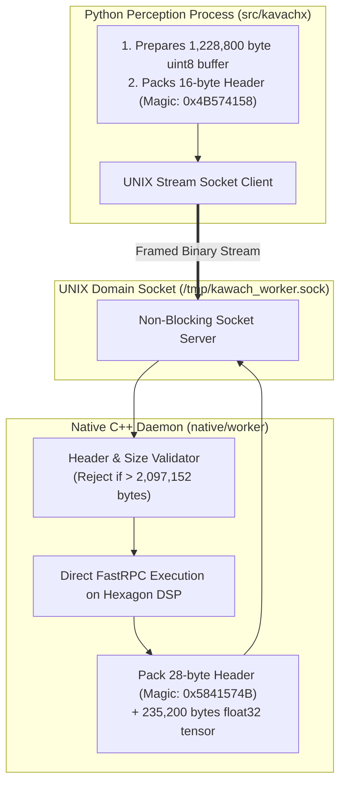

# Inter-Process Communication (IPC) Architecture

## 1. IPC Transport Diagram

```mermaid
flowchart TD
    subgraph CLIENT["Python Perception Process (src/kavachx)"]
        CLI_REQ["1. Prepares 1,228,800 byte uint8 buffer\n2. Packs 16-byte Header (Magic: 0x4B574158)"]
        CLI_SOCK["UNIX Stream Socket Client"]
        CLI_REQ --> CLI_SOCK
    end

    subgraph SOCKET["UNIX Domain Socket (/tmp/kawach_worker.sock)"]
        CLI_SOCK ==>|Framed Binary Stream| SRV_SOCK
    end

    subgraph WORKER["Native C++ Daemon (native/worker)"]
        SRV_SOCK["Non-Blocking Socket Server"]
        VALIDATOR["Header & Size Validator\n(Reject if > 2,097,152 bytes)"]
        QNN_EXEC["Direct FastRPC Execution on Hexagon DSP"]
        RESP_PACK["Pack 28-byte Header (Magic: 0x5841574B)\n+ 235,200 bytes float32 tensor"]
        
        SRV_SOCK --> VALIDATOR
        VALIDATOR --> QNN_EXEC
        QNN_EXEC --> RESP_PACK
        RESP_PACK --> SRV_SOCK
    end
```
