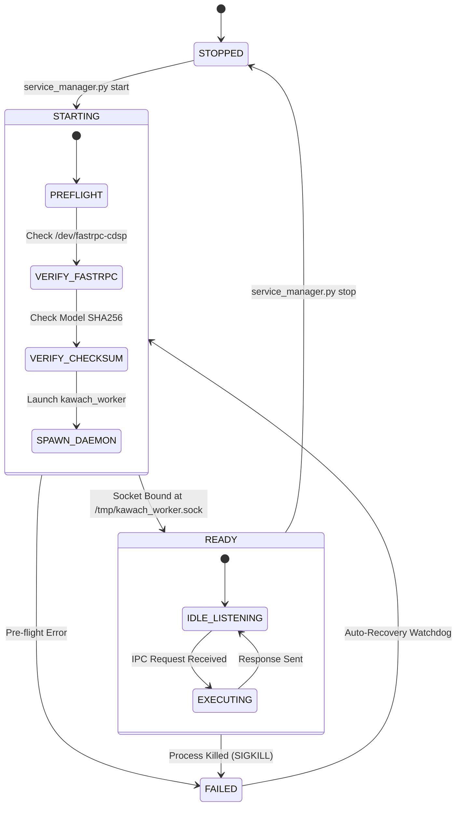

# Process Lifecycle & Supervisor State Machine

## 1. Supervisor State Machine

```mermaid
stateDiagram-v2
    [*] --> STOPPED
    STOPPED --> STARTING: service_manager.py start
    
    state STARTING {
        [*] --> PREFLIGHT
        PREFLIGHT --> VERIFY_FASTRPC: Check /dev/fastrpc-cdsp
        VERIFY_FASTRPC --> VERIFY_CHECKSUM: Check Model SHA256
        VERIFY_CHECKSUM --> SPAWN_DAEMON: Launch kawach_worker
    }
    
    STARTING --> READY: Socket Bound at /tmp/kawach_worker.sock
    STARTING --> FAILED: Pre-flight Error
    
    state READY {
        [*] --> IDLE_LISTENING
        IDLE_LISTENING --> EXECUTING: IPC Request Received
        EXECUTING --> IDLE_LISTENING: Response Sent
    }
    
    READY --> FAILED: Process Killed (SIGKILL)
    FAILED --> STARTING: Auto-Recovery Watchdog
    READY --> STOPPED: service_manager.py stop
```
