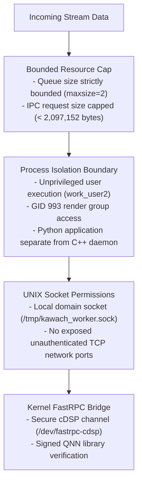

# Security Architecture & Controls

## 1. Implemented Security Controls

```mermaid
flowchart TD
    INPUT["Incoming Stream Data"] --> BOUND["Bounded Resource Cap\n- Queue size strictly bounded (maxsize=2)\n- IPC request size capped (< 2,097,152 bytes)"]
    
    BOUND --> PROCESS_ISO["Process Isolation Boundary\n- Unprivileged user execution (work_user2)\n- GID 993 render group access\n- Python application separate from C++ daemon"]
    
    PROCESS_ISO --> SOCK_RESTRICT["UNIX Socket Permissions\n- Local domain socket (/tmp/kawach_worker.sock)\n- No exposed unauthenticated TCP network ports"]
    
    SOCK_RESTRICT --> KERNEL_FASTRPC["Kernel FastRPC Bridge\n- Secure cDSP channel (/dev/fastrpc-cdsp)\n- Signed QNN library verification"]
```
