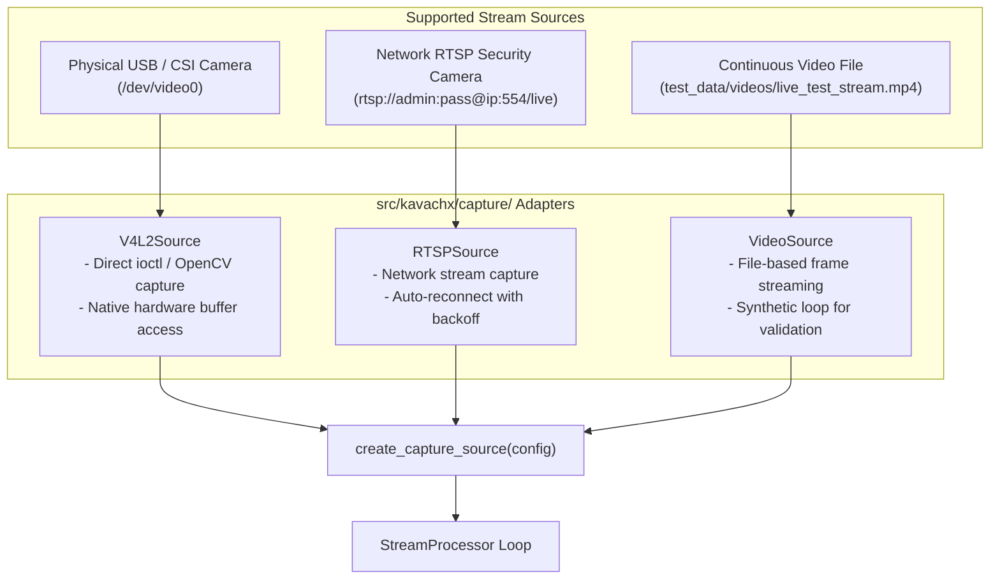

# Camera Ingestion Architecture

```mermaid
flowchart TD
    subgraph SOURCES["Supported Stream Sources"]
        S1["Physical USB / CSI Camera\n(/dev/video0)"]
        S2["Network RTSP Security Camera\n(rtsp://admin:pass@ip:554/live)"]
        S3["Continuous Video File\n(test_data/videos/live_test_stream.mp4)"]
    end

    subgraph ADAPTERS["src/kavachx/capture/ Adapters"]
        S1 --> A1["V4L2Source\n- Direct ioctl / OpenCV capture\n- Native hardware buffer access"]
        S2 --> A2["RTSPSource\n- Network stream capture\n- Auto-reconnect with backoff"]
        S3 --> A3["VideoSource\n- File-based frame streaming\n- Synthetic loop for validation"]
    end

    A1 & A2 & A3 --> FACTORY["create_capture_source(config)"]
    FACTORY --> PIPELINE["StreamProcessor Loop"]
```
