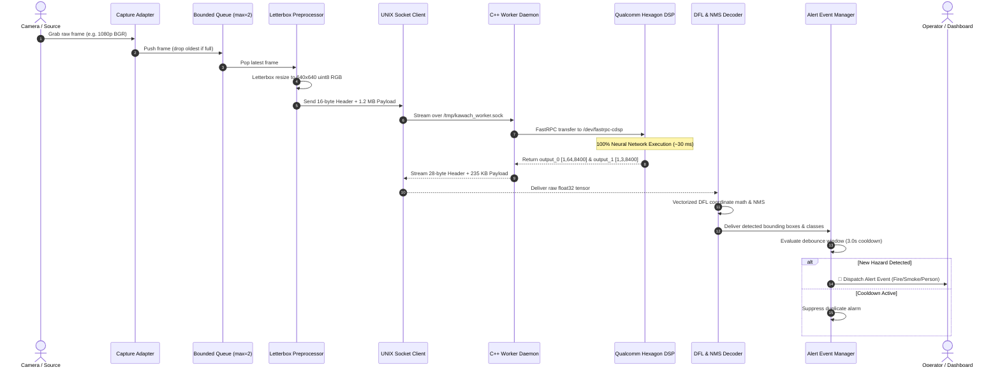

# Complete Frame Lifecycle & Sequence

## 1. End-to-End Sequence Diagram

```mermaid
sequenceDiagram
    autonumber
    actor Camera as Camera / Source
    participant Capture as Capture Adapter
    participant Queue as Bounded Queue (max=2)
    participant Preproc as Letterbox Preprocessor
    participant IPC as UNIX Socket Client
    participant Worker as C++ Worker Daemon
    participant DSP as Qualcomm Hexagon DSP
    participant Decoder as DFL & NMS Decoder
    participant EventMgr as Alert Event Manager
    actor Operator as Operator / Dashboard

    Camera->>Capture: Grab raw frame (e.g. 1080p BGR)
    Capture->>Queue: Push frame (drop oldest if full)
    Queue->>Preproc: Pop latest frame
    Preproc->>Preproc: Letterbox resize to 640x640 uint8 RGB
    Preproc->>IPC: Send 16-byte Header + 1.2 MB Payload
    IPC->>Worker: Stream over /tmp/kawach_worker.sock
    Worker->>DSP: FastRPC transfer to /dev/fastrpc-cdsp
    Note over DSP: 100% Neural Network Execution (~30 ms)
    DSP-->>Worker: Return output_0 [1,64,8400] & output_1 [1,3,8400]
    Worker-->>IPC: Stream 28-byte Header + 235 KB Payload
    IPC-->>Decoder: Deliver raw float32 tensor
    Decoder->>Decoder: Vectorized DFL coordinate math & NMS
    Decoder->>EventMgr: Deliver detected bounding boxes & classes
    EventMgr->>EventMgr: Evaluate debounce window (3.0s cooldown)
    alt New Hazard Detected
        EventMgr->>Operator: 🚨 Dispatch Alert Event (Fire/Smoke/Person)
    else Cooldown Active
        EventMgr->>EventMgr: Suppress duplicate alarm
    end
```
