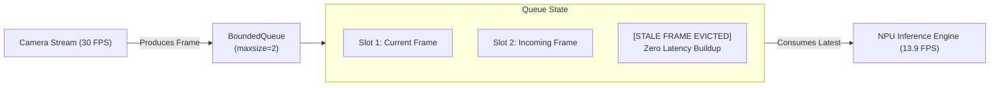

# Bounded Queue & Drop-Tail Policy

## 1. Queue Architecture Under Backpressure

---

## 2. Why Unbounded Queues Are Dangerous in Edge Vision
In industrial edge safety monitoring, if ingestion throughput ($30\text{ FPS}$) exceeds processing capacity ($13.9\text{ FPS}$), an unbounded queue will buffer frames. Within 60 seconds, an operator would be viewing fire alerts that occurred 30 seconds in the past, and device RAM would exhaust. The **`BoundedQueue` (maxsize=2)** guarantees that the perception engine always processes the **freshest available frame** with sub-$70\text{ ms}$ real-time latency.
