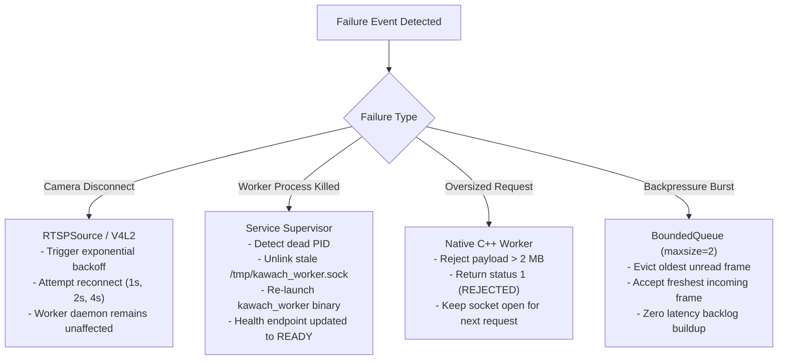

# Failure Recovery Architecture

```mermaid
flowchart TD
    FAILURE["Failure Event Detected"] --> CLASSIFY{"Failure Type"}

    CLASSIFY -->|Camera Disconnect| CAM_REC["RTSPSource / V4L2\n- Trigger exponential backoff\n- Attempt reconnect (1s, 2s, 4s)\n- Worker daemon remains unaffected"]
    
    CLASSIFY -->|Worker Process Killed| WRK_REC["Service Supervisor\n- Detect dead PID\n- Unlink stale /tmp/kawach_worker.sock\n- Re-launch kawach_worker binary\n- Health endpoint updated to READY"]
    
    CLASSIFY -->|Oversized Request| IPC_REC["Native C++ Worker\n- Reject payload > 2 MB\n- Return status 1 (REJECTED)\n- Keep socket open for next request"]
    
    CLASSIFY -->|Backpressure Burst| Q_REC["BoundedQueue (maxsize=2)\n- Evict oldest unread frame\n- Accept freshest incoming frame\n- Zero latency backlog buildup"]
```
