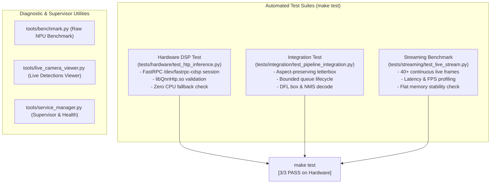

# Testing Architecture & Verification System

```mermaid
flowchart TD
    subgraph TEST_SUITES["Automated Test Suites (make test)"]
        T1["Hardware DSP Test\n(tests/hardware/test_htp_inference.py)\n- FastRPC /dev/fastrpc-cdsp session\n- libQnnHtp.so validation\n- Zero CPU fallback check"]
        T2["Integration Test\n(tests/integration/test_pipeline_integration.py)\n- Aspect-preserving letterbox\n- Bounded queue lifecycle\n- DFL box & NMS decode"]
        T3["Streaming Benchmark\n(tests/streaming/test_live_stream.py)\n- 40+ continuous live frames\n- Latency & FPS profiling\n- Flat memory stability check"]
    end

    subgraph TOOLS["Diagnostic & Supervisor Utilities"]
        U1["tools/benchmark.py (Raw NPU Benchmark)"]
        U2["tools/live_camera_viewer.py (Live Detections Viewer)"]
        U3["tools/service_manager.py (Supervisor & Health)"]
    end

    T1 & T2 & T3 --> MAKE_TEST["make test\n[3/3 PASS on Hardware]"]
```
